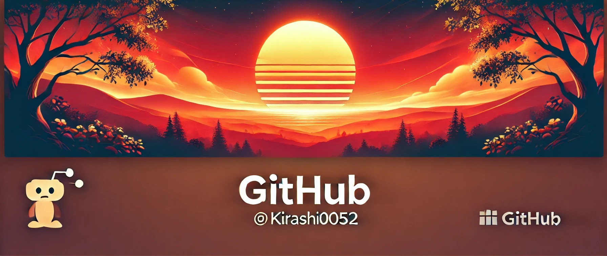

<h1 align="center">Hi, I'm Alex! 👋</h1>
<h3 align="center">Programmer & Cybersecurity Enthusiast from Germany</h3>

  

### 👨‍💻 About Me

- 🔭 I'm currently working on **Python Algorithms**
- 🌱 I'm learning **Python** and **C#**
- 🔒 Passionate about **Cybersecurity**
- 🇩🇪 Software Engineer from Germany

### 🛠️ Technologies & Tools

  
  
  

### 📊 GitHub Stats & Achievements

  
  

### 🌟 Featured Projects

  
  
A collection of Python algorithms and data structures

### 🤝 Connect with Me

  
  

### 📈 Activity Graph

  

  

